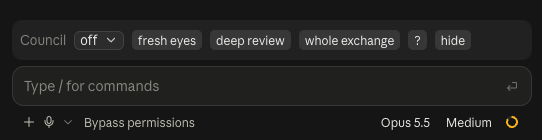

# council

A Claude Code mod that brings a second model into your chat when the first one gets tired, stuck or sloppy.

- **Fresh eyes.** After a long run of iterations you and the agent start going in circles. Press *fresh eyes*, ask your question, and GPT (through the Codex CLI) gets a short brief of the chat and answers like a senior engineer who has never seen it, searching the web when the question is about models or libraries. Its answer lands in the chat. Claude sorts it ("70% of this we already have, these three things I'd take"), GPT replies to that, and Claude sums up the next steps. Every message is in the chat, in full: watching the two argue is half the point.
- **Acceptance.** Agents under pressure cut corners and report "done". In *acceptance* mode, after every handover Codex checks the work against everything you asked for in the chat, the spec, the mockup and the acceptance criteria. A gross violation sends the agent back to fix it before it answers you.
- **Review.** In *review* mode Codex and a fresh Claude hunt for bugs in every change; *deep review* adds Claude Opus and Gemini for one turn.

## The band



A row above the prompt:

| Control | What it does |
| --- | --- |
| off / acceptance / review / review all | what runs after each turn: nothing; Codex acceptance of every handover; Codex and Claude bug review of every change; review of long answers with no edits too |
| fresh eyes | your next message goes to GPT as the question |
| deep review | the next change goes to Codex, Claude Opus and Gemini, once |
| whole exchange | the last fresh-eyes exchange in a side pane |
| ? | a short help under the band |
| hide | hides the band; `/council show` brings it back |

While a brief is written, GPT thinks or a reviewer checks, the band shows a spinner with a seconds counter, so you can tell the work is moving.

## Install

You need Claude Code 2.1.286 or later (mods, that is, function hooks) and the reviewers you plan to use on your `PATH`:

- [Codex CLI](https://github.com/openai/codex) (`codex`), signed in: fresh eyes, acceptance, review;
- Claude Code itself (`claude`): review;
- optional, deep review only: the [Antigravity](https://antigravity.google) CLI (`agy`) for Gemini.

```bash
git clone https://github.com/danzerzine/claude-council ~/claude-council
claude --plugin-dir ~/claude-council
```

To load it in every session, the desktop app included, add it to the `env` block of `~/.claude/settings.json`:

```json
{ "env": { "CLAUDE_CODE_PLUGIN_DIRS": "/Users/you/claude-council" } }
```

Everything starts off. Pick a mode in the band or with a command.

## Commands

```
/council                          show the current mode
/council off|accept|auto|always   after-turn checks (kept across sessions)
/council deep                     deep review for the next change only
/council ask <question>           fresh eyes on a question
/council hide | show              hide or bring back the band
/council lang en|ru               interface language (English by default)
```

## How it works

**Fresh eyes** asks the main agent, through a fork of the current chat, for a brief of up to 900 words: the goal as you first stated it, where the work went, what was tried and dropped, short verbatim samples of the real data, the measured numbers, and absolute paths to the project, its data and its logs. GPT runs read-only with live web search, opens what the brief points to and writes its answer for a human. The mod pastes that answer into the chat as a message and asks the agent to sort it without changing anything yet. When the agent's turn ends, its answer goes back to GPT; GPT's reply is pasted in turn, and the agent sums up.

**Acceptance and review** hook the end of the agent's turn (`classic.Stop`). Acceptance fires when the turn edited files, committed, or says it is done ("done", "fixed", "ready"…); review fires on edits and commits. The packet holds your messages (for acceptance, all of them in this chat, since the spec often sits several messages back), the agent's report and `git diff HEAD` for every touched file, capped at 40,000 characters. Reviewers run read-only: `codex exec -s read-only` and `claude -p --permission-mode plan` with a $2 budget ($4 for Opus). They answer with JSON findings:

- **P0/P1** (a criterion not met, a false claim of done or tested, faked data, a real bug): the turn is blocked, and the agent gets the findings with an instruction to verify each, fix what holds and tell you what it rejected and why;
- **P2**: one line in the transcript, nothing blocks.

A turn is checked at most twice (three times in deep review), so a disagreement can't loop forever.

Reviewers run with `COUNCIL_REVIEWER=1`, and the mod stays quiet in any session that has it, so a reviewer's own Claude never reviews itself. It also does nothing in non-interactive `claude -p` runs.

## Limits

- Acceptance compares the mockup through its files and the code. It does not render the page; screenshots the agent saved are opened if the brief or report names them.
- On the desktop app the band can't show hover tooltips, hence the `?` button.

## Cost and time

A review takes 20–90 seconds, mostly Codex. Fresh eyes takes a few minutes and runs in the background between turns. Both use your own Codex and Claude subscriptions or API keys.

## Develop

```bash
cd ~/claude-council
claude plugin validate .
```

For type checking, run `/plugin-types .` once in Claude Code to write the API types into `.claude/types`, then `npx -p typescript tsc -p .`.

## License

MIT
